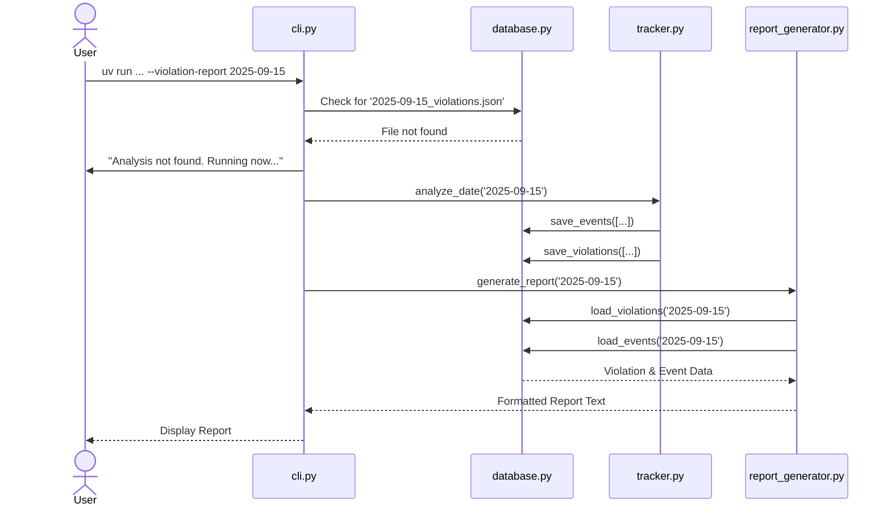

# Bark Detector Brownfield Enhancement Architecture

## Introduction

This document outlines the architectural approach for enhancing the Bark Detector with a refactored violation reporting system. Its primary goal is to serve as the guiding architectural blueprint for AI-driven development of this new feature while ensuring seamless integration with the existing system. This document is based on the provided `prd.md` and my prior analysis of the codebase.

### Existing Project Analysis

  * **Current Project State**: The project is a modular Python 3.11 application using the YAMNet ML model for real-time bark detection. It is designed to run on both Intel and Apple Silicon macOS platforms. The core problem, as identified in the PRD, is the unreliability of its two conflicting violation reporting features, which undermines the project's primary goal of legal evidence collection.
  * **Available Documentation**: This architecture is informed by the PRD and a prior brownfield analysis document. These documents cover the existing tech stack, source tree organization, and known technical debt.
  * **Identified Constraints**: The new architecture must remain compatible with the existing CLI structure, core data models (`BarkEvent`, `BarkingSession`), and the platform-specific `install.py` script. The solution must not introduce significant performance degradation.

### Change Log

| Change | Date | Version | Description | Author |
| :--- | :--- | :--- | :--- | :--- |
| Initial Draft | 2025-09-14 | 0.1 | Initial draft of the Brownfield Architecture based on the new PRD. | Winston (Architect) |

-----

## Enhancement Scope and Integration Strategy

### Enhancement Overview

  * **Enhancement Type**: Major Feature Modification and Bug Fix and Stability Improvements.
  * **Scope**: To fix and improve the core functionality for analyzing recorded audio and generating accurate, reliable violation reports suitable for submission as evidence to the RDCO.
  * **Integration Impact**: This is a **Significant Impact** enhancement, involving substantial changes to the existing analysis and reporting code.

### Integration Approach

The new reporting system will be integrated by replacing the existing brittle and conflicting workflows with a single, robust, database-driven pipeline.

  * **Code Integration Strategy**: The `--enhanced-violation-report` command and its underlying `LogBasedReportGenerator` will be deprecated and removed. All analysis logic will be consolidated into the `bark_detector/legal/tracker.py` module, which will serve as the sole analysis engine.
  * **Database Integration**: We will formalize the date-stamped JSON files (`[YYYY-MM-DD]_events.json` and `[YYYY-MM-DD]_violations.json`) as the official data persistence layer, making it the single source of truth for all reporting.
  * **API Integration**: The internal workflow will be streamlined. The `--violation-report` CLI command will be made "smart," automatically triggering the analysis process (`--analyze-violations` logic) if the required data files for a given date do not exist before generating a report.

### Compatibility Requirements

The following constraints from the PRD must be respected throughout the implementation:

  * **Existing API Compatibility**: Existing CLI commands must remain functional, even as their internal logic is overhauled.
  * **Data Model Compatibility**: The core data models (`BarkEvent`, `BarkingSession`, `ViolationReport`) should not be altered unless critical to the bug fixes.
  * **Performance Impact**: The refactored pipeline must not introduce significant performance degradation.

-----

## Tech Stack Alignment

### Existing Technology Stack

The enhancement will be built using the project's current, established technologies.

| Category | Current Technology | Version | Usage in Enhancement | Notes |
| :--- | :--- | :--- | :--- | :--- |
| **Language** | Python | 3.11.4 | The refactored `LegalViolationTracker` and new reporting logic will be written in Python. | No version change required. |
| **Package Manager** | uv | - | Will be used to run all development, testing, and analysis commands. | Adherence to `uv run ...` is critical. |
| **ML Model** | Google YAMNet | 1 | The analysis engine will continue to use the existing detector's YAMNet predictions as the source of bark events. | The core detection logic is not being changed in this epic. |
| **Audio Processing**| Librosa, SoundFile| \>=0.9.0 | Used by the `LegalViolationTracker` to read and process audio from the `recordings/` directory for analysis. | Existing libraries are sufficient for the task. |
| **Testing** | pytest, pytest-mock| \>=7.0.0 | The existing test suite will be expanded to validate the bug fixes and new data persistence logic. | New integration tests are a key requirement for this epic. |

### New Technology Additions

No new technologies or major dependencies are required for this enhancement.

-----

## Data Models and Schema Changes

### New Data Models

#### PersistedBarkEvent

  * **Purpose**: To serve as a raw, persistent log of every individual bark event detected during an analysis run, decoupled from the final violation interpretation.
  * **Integration**: This model will be the schema for records stored in the new `[YYYY-MM-DD]_events.json` files.
  * **Key Attributes**:
      * `realworld_date`, `realworld_time`, `bark_id`, `bark_type`, `est_dog_size` (nullable for future use), `audio_file_name`, `bark_audiofile_timestamp`, **`confidence`**, **`intensity`**.

#### Violation

  * **Purpose**: To logically separate the raw analysis result from the final formatted `ViolationReport`. This provides greater flexibility for debugging and filtering.
  * **Integration**: This will be the schema for records stored in the new `[YYYY-MM-DD]_violations.json` files.
  * **Key Attributes**:
      * `violation_id`, `violation_type`, `violation_date`, `violation_start_time`, `violation_end_time`, `bark_event_ids` (an array of `bark_id`s from the events file).

### Schema Integration Strategy

  * **New Files**: The system will now generate two files per day of analysis: **`[YYYY-MM-DD]_events.json`** and **`[YYYY-MM-DD]_violations.json`**.
  * **Refactored Model**: The existing `ViolationReport` model will be refactored to become a presentation-layer object, generated on-the-fly from the raw `Violation` data.
  * **Migration Strategy**: A post-deployment task will be to run `--analyze-violations` for all historical recording dates to back-populate the new data structure.

-----

## Component Architecture

### Modified Components

  * **`bark_detector/cli.py` (Orchestration Layer)**: Will be updated to house the "smart" logic for the consolidated `--violation-report` command and remove the deprecated command.
  * **`bark_detector/legal/tracker.py` (Analysis Engine)**: Will be refactored to be the sole engine for analysis, responsible for processing audio and persisting results via the `ViolationDatabase`.
  * **`bark_detector/legal/database.py` (Persistence Layer)**: Will be enhanced to manage all read/write operations for the new `_events.json` and `_violations.json` files.
  * **`bark_detector/utils/report_generator.py` (Reporting Layer)**: Will be refactored to read data exclusively from the `ViolationDatabase`, completely decoupling it from application logs.

### Component Interaction Diagram

-----

## API Design and Integration

### API Integration Strategy

The primary strategy is to simplify the user-facing CLI by deprecating the redundant `--enhanced-violation-report` command and consolidating all reporting functionality into a single, intelligent `--violation-report` command.

### Modified CLI Commands

  * **`--analyze-violations [DATE]`**: This command's role is clarified as the primary data-generation tool, performing deep analysis of audio files and populating the `_events.json` and `_violations.json` files.
  * **`--violation-report [START_DATE] [END_DATE]`**: This becomes the single, primary command for users to get a report. It will now automatically trigger the analysis if the required data for the requested date(s) is not found.
  * **`--enhanced-violation-report`**: This command will be **deprecated and removed**.
