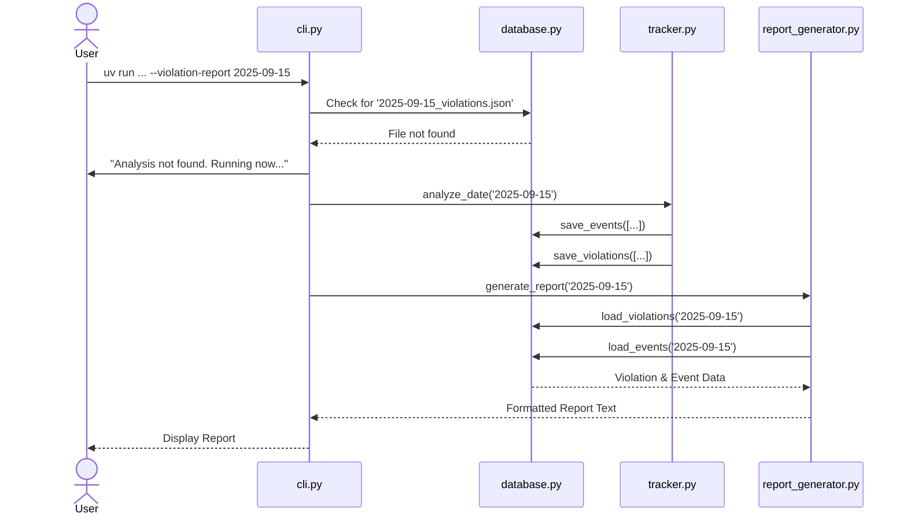

# Component Architecture

## Modified Components

  * **`bark_detector/cli.py` (Orchestration Layer)**: Will be updated to house the "smart" logic for the consolidated `--violation-report` command and remove the deprecated command.
  * **`bark_detector/legal/tracker.py` (Analysis Engine)**: Will be refactored to be the sole engine for analysis, responsible for processing audio and persisting results via the `ViolationDatabase`.
  * **`bark_detector/legal/database.py` (Persistence Layer)**: Will be enhanced to manage all read/write operations for the new `_events.json` and `_violations.json` files.
  * **`bark_detector/utils/report_generator.py` (Reporting Layer)**: Will be refactored to read data exclusively from the `ViolationDatabase`, completely decoupling it from application logs.

## Component Interaction Diagram

-----
