# Bark Detector Violation Report Generation Overhaul - Brownfield Enhancement Architecture

## Introduction

This document outlines the architectural approach for enhancing the Bark Detector with a complete violation report generation overhaul, replacing the deprecated LogBasedReportGenerator with a robust PDF generation system. Its primary goal is to serve as the guiding architectural blueprint for AI-driven development of Epic 1 while ensuring seamless integration with the existing system.

**Relationship to Existing Architecture:**
This document supplements existing project architecture by defining how new PDF generation components will integrate with current systems. Where conflicts arise between new and existing patterns, this document provides guidance on maintaining consistency while implementing enhancements.

### Existing Project Analysis

Based on comprehensive analysis of the existing project structure and architecture:

**Current Project State:**
- **Primary Purpose:** ML-based bark detection system for legal evidence collection against Regional District of Central Okanagan (RDCO) and City of Kelowna noise bylaws
- **Current Tech Stack:** Python 3.11.4, YAMNet/TensorFlow Hub, UV package manager, pytest testing framework
- **Architecture Style:** Modular Python package (bark_detector/) with distinct core/, legal/, utils/, recording/ modules
- **Deployment Method:** Cross-platform support via install.py with platform-specific dependency management

**Available Documentation:**
- Complete architecture documentation in docs/architecture/ with established tech-stack.md, source-tree.md, coding-standards.md
- Existing violation report generation analysis identifying LogBasedReportGenerator as brittle and deprecated
- Comprehensive BMAD project structure with PRDs, stories, and QA assessments

**Critical Architectural Constraints:**
- Must maintain CLI interface compatibility (--violation-report command signature)
- Must preserve existing JSON data persistence structure (violations/YYYY-MM-DD/ format)
- Cannot introduce significant performance degradation for legal evidence processing
- Must respect existing data models (PersistedBarkEvent, Violation, ViolationReport) for continuity

**Integration Points Identified:**
- **Existing LogBasedReportGenerator** (510 lines) - marked for complete replacement, has complex data model duplication
- **ViolationDatabase** - robust foundation with dual-mode support (legacy + date-partitioned)
- **Legal data models** - well-defined PersistedBarkEvent, Violation, ViolationReport schemas already in place
- **CLI orchestration** - established pattern in cli.py for command routing and error handling

### Change Log

| Change | Date | Version | Description | Author |
|--------|------|---------|-------------|--------|
| Initial Architecture | 2025-09-24 | 1.0 | Comprehensive brownfield architecture for PDF generation enhancement | Winston (Architect) |

---

## Enhancement Scope and Integration Strategy

### Enhancement Overview

- **Enhancement Type:** Major Feature Replacement and Data Pipeline Consolidation
- **Scope:** Complete replacement of the deprecated `LogBasedReportGenerator` with a robust, database-driven PDF report generation system that leverages existing violation analysis infrastructure
- **Integration Impact:** High Impact - involves removing deprecated code, unifying data models, and introducing PDF generation capability while maintaining full CLI compatibility

### Integration Approach

**Code Integration Strategy:**
The enhancement will integrate by leveraging your existing modular architecture:
- **Remove deprecated components:** Complete removal of `LogBasedReportGenerator` (510 lines) and its duplicate data models
- **Enhance existing services:** Extend `ViolationDatabase` with new PDF generation orchestration methods
- **Unify data flow:** Consolidate all reporting through the established `PersistedBarkEvent` → `Violation` → `ViolationReport` pipeline
- **Preserve CLI interface:** Maintain exact `--violation-report YYYY-MM-DD` signature while enhancing internal behavior

**Database Integration:**
Your existing date-partitioned JSON structure provides the perfect foundation:
- **Leverage existing persistence:** Use established `violations/YYYY-MM-DD/YYYY-MM-DD_events.json` and `YYYY-MM-DD_violations.json` files as single source of truth
- **Smart analysis triggering:** Automatically invoke `--analyze-violations` logic when required data files don't exist
- **No schema changes:** Work entirely within your current `PersistedBarkEvent` and `Violation` models

**API Integration:**
- **CLI consolidation:** Transform `--violation-report` into an intelligent orchestrator that handles both analysis and reporting
- **Internal API consistency:** Use existing `LegalViolationTracker.analyze_recordings_for_date()` patterns for data generation
- **Error handling alignment:** Follow established CLI error handling patterns from your existing commands

**UI Integration:**
- **PDF output enhancement:** Introduce professional PDF generation to replace text-based reports
- **Visual graph integration:** Add bark intensity visualization using existing confidence/intensity data from `PersistedBarkEvent`
- **Maintain report structure:** Preserve familiar summary + detailed report organization

### Compatibility Requirements

- **Existing API Compatibility:** All CLI commands maintain identical signatures and behavior from user perspective
- **Database Schema Compatibility:** Zero changes to existing `PersistedBarkEvent`, `Violation`, and `ViolationReport` schemas
- **UI/UX Consistency:** PDF reports follow same information hierarchy as current text reports, enhanced with professional formatting
- **Performance Impact:** Negligible performance change - PDF generation only adds output formatting overhead, actual analysis remains identical

---

## Tech Stack

### Existing Technology Stack

Your current stack provides an excellent foundation for the enhancement:

| Category | Current Technology | Version | Usage in Enhancement | Notes |
|----------|-------------------|---------|---------------------|--------|
| **Language** | Python | 3.11.4 | PDF report generation service and enhanced CLI orchestration | No version change required - perfect compatibility |
| **Package Manager** | uv | latest | All development, testing, and deployment via `uv run` commands | Critical for maintaining cross-platform dependency management |
| **ML Framework** | TensorFlow + TensorFlow Hub | latest | No direct usage - leverages existing YAMNet results via `PersistedBarkEvent` data | Enhancement is downstream of ML processing |
| **Audio Processing** | Librosa, SoundFile | >=0.9.0 | No direct usage - operates on pre-analyzed violation data | Enhancement works with post-processed results |
| **Data Models** | Python dataclasses, typing | built-in | Extending existing `PersistedBarkEvent`, `Violation`, `ViolationReport` models | Zero model changes required |
| **Testing Framework** | pytest, pytest-mock | >=7.0.0 | New PDF generation tests integrated with existing 204-test suite | Maintains established testing patterns |
| **JSON Processing** | json (stdlib) | built-in | Reading violation data from established date-partitioned structure | Leverages existing ViolationDatabase patterns |
| **File Operations** | pathlib, os | built-in | PDF output to reports/ directory following existing patterns | Consistent with current file organization |

### New Technology Additions

Strategic additions for PDF generation capability:

| Technology | Version | Purpose | Rationale | Integration Method |
|------------|---------|---------|-----------|-------------------|
| **ReportLab** | >=4.0.4 | Professional PDF document generation | Industry standard for Python PDF creation, excellent legal document formatting capabilities | `uv add reportlab` - integrates via new `PDFReportGenerator` class |
| **matplotlib** | >=3.7.2 | Bark intensity visualization graphs | Already common in data science workflows, excellent chart generation for legal evidence | `uv add matplotlib` - used for embedded PDF charts |
| **Pillow (PIL)** | ~10.0 | Image processing for PDF graphics | Dependency of matplotlib, handles chart rendering and PDF embedding | Automatic dependency of matplotlib |

---

## Data Models and Schema Changes

### Existing Data Models (No Changes Required)

Your current data architecture already provides everything needed for professional PDF report generation:

#### PersistedBarkEvent (Already Perfect)
- **Purpose:** Raw bark detection data with complete temporal and acoustic metadata
- **Integration:** PDF reports will consume this data directly from `YYYY-MM-DD_events.json` files
- **Key Attributes Available:**
  - `realworld_date`, `realworld_time`: Perfect for legal evidence timestamps
  - `bark_id`: Enables cross-referencing between events and violations
  - `bark_type`: Provides classification detail for report narratives
  - `audio_file_name`, `bark_audiofile_timestamp`: Critical for audio evidence correlation
  - `confidence`, `intensity`: Essential data for visualization graphs
  - `est_dog_size`: Future enhancement potential for report detail

#### Violation (Already Comprehensive)
- **Purpose:** Legal violation records with three-timestamp architecture for compliance
- **Integration:** PDF reports consume this data from `YYYY-MM-DD_violations.json` files
- **Key Attributes Available:**
  - `type`: "Continuous" or "Intermittent" for legal classification
  - `startTimestamp`, `violationTriggerTimestamp`, `endTimestamp`: Complete temporal audit trail
  - `durationMinutes`, `violationDurationMinutes`: Pre-calculated durations for reports
  - `barkEventIds`: Links to specific bark events for detailed evidence

#### ViolationReport (Presentation Layer Ready)
- **Purpose:** Formatted violation data optimized for human-readable output
- **Integration:** PDF generation will enhance this model's output formatting capabilities
- **Key Attributes Available:**
  - `date`, `start_time`, `end_time`: RDCO-compliant time formatting
  - `violation_type`: Legal classification for report headers
  - `audio_files`, `audio_file_start_times`, `audio_file_end_times`: Complete audio evidence mapping
  - `confidence_scores`, `peak_confidence`, `avg_confidence`: Statistical data for charts

### Schema Integration Strategy

**No Database Changes Required:**
Your existing date-partitioned JSON structure is ideal for PDF report generation:

- **Existing Files Consumed:**
  - `violations/YYYY-MM-DD/YYYY-MM-DD_events.json`: Raw bark event data for detailed analysis
  - `violations/YYYY-MM-DD/YYYY-MM-DD_violations.json`: Legal violation records for summary reporting
  - Audio files in `recordings/YYYY-MM-DD/`: Referenced for evidence correlation

- **New Files Generated:**
  - `reports/YYYY-MM-DD_Violation_Report.pdf`: Professional PDF output (Epic 1 requirement)
  - `reports/YYYY-MM-DD/` directory: Supporting charts and metadata (optional organization)

---

## Component Architecture

### New Components

#### PDFReportGenerator
**Responsibility:** Professional PDF report generation from existing violation data, replacing the deprecated LogBasedReportGenerator

**Integration Points:**
- Consumes data via existing `ViolationDatabase.load_violations_new()` and `ViolationDatabase.load_events()` methods
- Integrates with established `reports/` directory file organization patterns
- Follows your existing error handling and logging patterns from utils/ modules

**Key Interfaces:**
- `generate_report(date: str) -> Path`: Main entry point returning PDF file path
- `generate_summary_report(violations: List[Violation]) -> ReportLab Document`: Summary page generation
- `generate_detail_report(violation: Violation, events: List[PersistedBarkEvent]) -> ReportLab Document`: Detailed violation pages

**Dependencies:**
- **Existing Components:** `ViolationDatabase` for data access, `ConfigManager` for output directory settings
- **New Components:** `ChartGenerator` for visualization creation
- **External Libraries:** ReportLab for PDF generation, pathlib for file operations

**Technology Stack:** ReportLab PDF generation, follows existing utils/ module patterns

#### ChartGenerator
**Responsibility:** Bark intensity and timeline visualizations for legal evidence documentation

**Integration Points:**
- Processes existing `PersistedBarkEvent.confidence` and `PersistedBarkEvent.intensity` data
- Outputs charts compatible with ReportLab PDF embedding
- Follows established data processing patterns from your core/ modules

**Key Interfaces:**
- `create_intensity_timeline(events: List[PersistedBarkEvent]) -> matplotlib.Figure`: Time-series visualization
- `create_violation_overview(violation: Violation, events: List[PersistedBarkEvent]) -> matplotlib.Figure`: Summary chart
- `create_confidence_distribution(events: List[PersistedBarkEvent]) -> matplotlib.Figure`: Statistical analysis chart

**Dependencies:**
- **Existing Components:** None - pure data processing utility
- **New Components:** None - standalone chart generation
- **External Libraries:** matplotlib for chart generation, numpy for statistical calculations

**Technology Stack:** matplotlib + numpy for statistical visualization

#### Enhanced CLI Orchestrator (Modification to existing cli.py)
**Responsibility:** Intelligent coordination of analysis and PDF report generation, replacing manual workflow steps

**Integration Points:**
- Extends existing CLI command patterns in `cli.py`
- Integrates with established `LegalViolationTracker.analyze_recordings_for_date()` workflow
- Maintains existing error handling and user feedback patterns

**Key Interfaces:**
- `handle_violation_report_command(date: str)`: Enhanced CLI entry point with smart analysis triggering
- `check_analysis_data_exists(date: str) -> bool`: Data availability validation
- `trigger_analysis_if_needed(date: str)`: Automatic analysis orchestration

**Dependencies:**
- **Existing Components:** `LegalViolationTracker`, `ViolationDatabase`, existing CLI infrastructure
- **New Components:** `PDFReportGenerator` for output generation
- **External Libraries:** None - uses existing CLI framework

**Technology Stack:** Pure Python, existing CLI patterns

### Component Interaction Diagram

```mermaid
graph TB
    User["👤 User"]
    CLI["🔧 Enhanced CLI<br/>(cli.py)"]
    VDB["💾 ViolationDatabase<br/>(existing)"]
    LVT["⚖️ LegalViolationTracker<br/>(existing)"]
    PDF["📄 PDFReportGenerator<br/>(NEW)"]
    Chart["📊 ChartGenerator<br/>(NEW)"]
    Files["📁 File System"]

    User -->|"uv run python -m bark_detector<br/>--violation-report 2025-09-15"| CLI
    CLI -->|"1. Check data exists"| VDB
    VDB -->|"violations.json missing"| CLI
    CLI -->|"2. Auto-trigger analysis"| LVT
    LVT -->|"3. Process recordings"| Files
    LVT -->|"4. Save events & violations"| VDB
    CLI -->|"5. Generate PDF report"| PDF
    PDF -->|"6. Load violation data"| VDB
    PDF -->|"7. Load event data"| VDB
    VDB -->|"8. Return data"| PDF
    PDF -->|"9. Create visualizations"| Chart
    Chart -->|"10. Return charts"| PDF
    PDF -->|"11. Generate PDF"| Files
    PDF -->|"12. PDF file path"| CLI
    CLI -->|"13. Success message"| User

    style PDF fill:#e1f5fe
    style Chart fill:#e8f5e8
    style CLI fill:#fff3e0
    style VDB fill:#f3e5f5
    style LVT fill:#f3e5f5
```



---

## API Design and Integration

### API Integration Strategy

**CLI Integration Strategy:** Transform the existing `--violation-report` command into an intelligent orchestrator that eliminates manual workflow steps while preserving familiar user interfaces

**Authentication:** N/A - Local file system operations maintain existing security model

**Versioning:** No versioning required - enhancement maintains identical CLI signatures with enhanced internal behavior

### Enhanced CLI Commands

#### --violation-report [DATE] (Enhanced Behavior)
- **Method:** Command-line argument parsing (existing pattern)
- **Endpoint:** `uv run python -m bark_detector --violation-report YYYY-MM-DD`
- **Purpose:** Intelligent PDF report generation with automatic analysis triggering
- **Integration:** Seamlessly integrates with existing CLI framework in `cli.py`

**Enhanced Workflow Logic:**
```python
def handle_violation_report_command(date: str):
    # 1. Check if analysis data exists for date
    if not violation_database.has_violations_for_date(date):
        logger.info(f"Analysis data not found for {date}. Running analysis...")
        # 2. Auto-trigger analysis using existing LegalViolationTracker
        tracker = LegalViolationTracker()
        tracker.analyze_recordings_for_date(date)

    # 3. Generate PDF report using existing data
    pdf_generator = PDFReportGenerator()
    pdf_path = pdf_generator.generate_report(date)

    # 4. Provide user feedback
    logger.info(f"✅ PDF report generated: {pdf_path}")
```

**Request Pattern:**
```bash
# Existing usage - no change
uv run python -m bark_detector --violation-report 2025-09-15

# Enhanced behavior - automatic analysis if needed
# User sees: "Analysis data not found. Running analysis..."
# Then: "✅ PDF report generated: reports/2025-09-15_Violation_Report.pdf"
```

**Response Pattern:**
- **Success:** PDF file path and success message
- **No violations:** Informative message with empty report option
- **Error:** Detailed error message with troubleshooting guidance

#### --analyze-violations [DATE] (Preserved Behavior)
- **Method:** Command-line argument parsing (no changes)
- **Endpoint:** `uv run python -m bark_detector --analyze-violations YYYY-MM-DD`
- **Purpose:** Explicit analysis triggering for power users and automation
- **Integration:** Maintains existing behavior and output format

**Preserved Interface:**
- Identical command signature and behavior
- Same JSON file output structure and location
- Consistent logging and progress reporting
- Compatible with existing scripts and automation

#### Deprecated Commands (Removal Strategy)

**--enhanced-violation-report (To be removed):**
- **Deprecation Notice:** Command will display deprecation warning directing users to `--violation-report`
- **Timeline:** Immediate deprecation warning, removal in next version after Epic 1 completion
- **Migration Path:** All functionality moved to enhanced `--violation-report` with superior PDF output

---

## Source Tree

### Existing Project Structure (Preserved)

Your current organization provides the perfect foundation for PDF generation components:

```
bark_detector/
├── __init__.py                    # Package initialization
├── __main__.py                    # CLI entry point via python -m
├── cli.py                         # Command-line interface (Enhanced: --violation-report logic)
├── core/                          # ML detection and data models
│   ├── __init__.py
│   ├── detector.py                # YAMNet bark detection
│   └── models.py                  # BarkEvent, BarkingSession models
├── legal/                         # Legal evidence processing
│   ├── __init__.py
│   ├── database.py                # ViolationDatabase persistence
│   ├── models.py                  # PersistedBarkEvent, Violation models
│   └── tracker.py                 # LegalViolationTracker analysis
├── utils/                         # Shared utilities (Enhanced: PDF generation)
│   ├── __init__.py
│   ├── config.py                  # Configuration management
│   ├── helpers.py                 # Common utilities
│   ├── report_generator.py        # (DEPRECATED: LogBasedReportGenerator)
│   ├── tensorflow_suppression.py  # TensorFlow warning suppression
│   └── time_utils.py              # Time formatting utilities
├── recording/                     # Audio capture and conversion
├── calibration/                   # Calibration systems
```

### New File Organization

Strategic placement of PDF generation components within your established structure:

```
bark_detector/
├── utils/                         # Enhanced utilities module
│   ├── pdf_report_generator.py    # NEW: Professional PDF report generation
│   ├── chart_generator.py         # NEW: Bark intensity visualizations
│   ├── report_generator.py        # DEPRECATED: LogBasedReportGenerator (for removal)
│   └── pdf_templates.py           # NEW: PDF layout templates and formatting
├── legal/                         # No changes - existing models perfect
│   ├── database.py                # Enhanced: PDF-specific data access methods
├── cli.py                         # Enhanced: Smart --violation-report orchestration
```

### Integration Guidelines

**File Naming Consistency:**
- **snake_case naming** - Follows your established `report_generator.py`, `time_utils.py` patterns
- **Descriptive module names** - `pdf_report_generator.py` clearly indicates purpose and relationship to existing modules
- **Component-specific naming** - `chart_generator.py` follows your utilities naming convention

**Import/Export Patterns:**
```python
# Follows your established import patterns
from bark_detector.utils.pdf_report_generator import PDFReportGenerator
from bark_detector.utils.chart_generator import ChartGenerator
from bark_detector.legal.database import ViolationDatabase
from bark_detector.legal.models import Violation, PersistedBarkEvent

# Enhanced CLI integration
from bark_detector.cli import handle_violation_report_command
```

**Module Organization Principles:**
- **Single responsibility** - Each new module has focused purpose aligned with your existing architecture
- **Clear dependencies** - New modules only depend on existing stable interfaces (ViolationDatabase, models)
- **Testable isolation** - PDF generation components can be unit tested independently like existing utils/

---

## Infrastructure and Deployment Integration

### Existing Infrastructure

Your current deployment foundation provides excellent support for the PDF enhancement:

**Current Deployment:**
- Cross-platform Python via `uv` package manager with intelligent platform detection
- Platform-specific dependency management through `install.py` script
- Development on Apple Silicon, deployment to Intel Mac production environment

**Infrastructure Tools:**
- `uv` for dependency resolution and virtual environment management
- `install.py` for automated platform-aware TensorFlow and audio library installation
- Git-based source synchronization between development and deployment environments

**Environments:**
- **Development:** Apple Silicon Mac (M1/M2/M3) with full development toolchain
- **Production:** Intel Mac mini-class device for continuous bark monitoring
- **Testing:** Both platforms supported via comprehensive pytest suite (204 tests)

### Enhancement Deployment Strategy

**Deployment Approach:** Leverage existing `install.py` infrastructure with minimal PDF-specific additions

**Dependency Integration:**
```python
# Enhanced install.py additions (minimal changes)
PDF_DEPENDENCIES = [
    "reportlab>=4.0.4",
    "matplotlib>=3.7.2",
    "pillow>=10.0.0"  # matplotlib dependency
]

def install_pdf_dependencies():
    """Install PDF generation dependencies via uv"""
    for dep in PDF_DEPENDENCIES:
        run_uv_command(f"add {dep}")
```

**Infrastructure Changes:**
**New Directory Creation:**
```python
# Enhanced directory structure creation in install.py
def ensure_directory_structure():
    directories = [
        "recordings",
        "violations",
        "reports",      # Enhanced: PDF output directory
        "logs"
    ]
    for dir_name in directories:
        Path(dir_name).mkdir(exist_ok=True)
```

### Rollback Strategy

**Rollback Method:** Git-based rollback with dependency cleanup

**Automated Rollback Process:**
```bash
# 1. Git rollback to previous stable version
git checkout previous-stable-tag

# 2. Dependency cleanup (if needed)
uv sync  # Automatically removes unused dependencies

# 3. Verify system functionality
uv run python -m bark_detector --violation-report 2025-09-15
# Falls back to text-based reporting automatically
```

**Risk Mitigation:**
- **Feature flags** - PDF generation can be disabled via configuration without code rollback
- **Graceful degradation** - PDF generation failures automatically fall back to existing text reports
- **Zero data risk** - PDF enhancement only reads existing data, never modifies violation databases

**Monitoring:**
- **Existing logging infrastructure** - PDF generation integrates with established logging patterns
- **Error tracking** - PDF generation errors logged alongside existing CLI command errors
- **Performance monitoring** - PDF generation timing logged for performance regression detection

---

## Coding Standards

### Existing Standards Compliance

**Code Style:**
- **PEP 8 compliance** - Following your established formatting in existing utils/ and legal/ modules
- **Type hints** - Comprehensive typing annotations matching your legal/models.py patterns
- **Docstring standards** - Google-style docstrings consistent with existing ViolationDatabase and detector modules
- **Variable naming** - snake_case naming following your established patterns

**Linting Rules:**
- **Import organization** - Follow your established patterns (standard library, third-party, local imports)
- **Line length** - 88-character limit matching your existing code formatting
- **Function complexity** - Keep functions focused and testable like existing utils/ modules

**Testing Patterns:**
- **pytest framework** - Integrate with your existing 204-test suite architecture
- **Mock usage** - Use pytest-mock for external dependencies like existing TensorFlow mocking
- **Test organization** - Follow your established `test_utils/test_*.py` structure

**Documentation Style:**
- **Inline comments** - Minimal, focused on complex business logic like existing legal violation detection
- **Module docstrings** - Clear purpose statements following your established patterns
- **API documentation** - Type hints and docstrings sufficient for developer understanding

### Enhancement-Specific Standards

#### PDF Generation Code Organization
```python
"""Professional PDF report generation for legal evidence collection.

This module provides PDF generation capabilities for bark detector violation
reports, replacing the deprecated LogBasedReportGenerator with professional
legal document formatting.
"""

from typing import List, Optional, Path
from pathlib import Path
from reportlab.lib.pagesizes import letter
from reportlab.platypus import SimpleDocTemplate, Paragraph, Spacer

class PDFReportGenerator:
    """Generates professional PDF violation reports for legal evidence.

    Integrates with existing ViolationDatabase to consume violation data
    and produce legal-quality PDF reports for RDCO complaint submission.
    """
```

#### Error Handling Standards
```python
# Follow existing error handling patterns from ViolationDatabase
class PDFGenerationError(Exception):
    """Exception raised when PDF generation fails."""
    pass

def generate_report(self, date: str) -> Path:
    """Generate PDF report with comprehensive error handling."""
    try:
        violations = self.violation_database.load_violations_new(date)
        events = self.violation_database.load_events(date)

        if not violations:
            logger.warning(f"No violations found for {date}")
            return self._generate_empty_report(date)

        return self._create_pdf_report(violations, events, date)

    except Exception as e:
        logger.error(f"PDF generation failed for {date}: {e}")
        raise PDFGenerationError(f"Cannot generate PDF report: {e}") from e
```

### Critical Integration Rules

**Existing API Compatibility:**
- **No changes to ViolationDatabase interfaces** - PDF generation consumes existing methods without modification
- **CLI signature preservation** - `--violation-report YYYY-MM-DD` maintains identical user interface
- **Configuration integration** - Use existing ConfigManager patterns for PDF generation settings

**Database Integration:**
- **Read-only data access** - PDF generation never modifies violation or event data
- **Error handling alignment** - Follow ViolationDatabase error patterns for missing/corrupt data
- **Transaction safety** - No database transactions required, purely file-based operations

**Error Handling:**
- **Graceful degradation** - PDF generation failures fall back to existing text report generation
- **User-friendly messages** - Error messages provide clear guidance for troubleshooting
- **Logging consistency** - Use established logger patterns from existing modules

---

## Testing Strategy

### Integration with Existing Tests

**Existing Test Framework:**
- **pytest + pytest-mock** - Leveraging your proven testing stack with sophisticated mocking capabilities
- **204 comprehensive tests** - PDF generation tests will integrate with your established test organization
- **Cross-platform validation** - Following your existing patterns for Apple Silicon vs Intel Mac compatibility

**Test Organization:**
PDF generation tests will follow your established directory structure:
```
tests/
├── test_utils/                    # Enhanced with PDF generation tests
│   ├── test_pdf_report_generator.py    # NEW: PDF generation unit tests
│   ├── test_chart_generator.py         # NEW: Visualization unit tests
│   └── test_report_generator.py        # EXISTING: LogBasedReportGenerator (deprecated)
├── test_integration/              # Enhanced with PDF integration tests
│   ├── test_cli_pdf_reporting.py       # NEW: CLI PDF generation integration
│   └── test_analyze_violations.py      # EXISTING: Analysis integration
```

**Coverage Requirements:**
- **Unit test coverage >90%** - Matching your existing high coverage standards
- **Integration test coverage** - Complete CLI workflow validation including error scenarios
- **Cross-component testing** - PDF generation with ViolationDatabase integration validation

### New Testing Requirements

#### Unit Tests for New Components

**PDF Report Generator Testing:**
```python
# tests/test_utils/test_pdf_report_generator.py
import pytest
from pathlib import Path
from unittest.mock import Mock, patch, MagicMock
from bark_detector.utils.pdf_report_generator import PDFReportGenerator, PDFGenerationError

class TestPDFReportGenerator:
    """Comprehensive test suite for PDF report generation."""

    @pytest.fixture
    def sample_violations(self):
        """Sample violation data following existing test patterns."""
        # Use your established violation fixture patterns

    @pytest.fixture
    def sample_events(self):
        """Sample bark event data matching existing patterns."""
        # Leverage existing PersistedBarkEvent test data

    @patch('bark_detector.utils.pdf_report_generator.SimpleDocTemplate')
    def test_generate_report_success(self, mock_doc, sample_violations, sample_events):
        """Test successful PDF generation with mock ReportLab."""

    def test_generate_report_no_violations(self):
        """Test PDF generation when no violations exist for date."""

    def test_generate_report_missing_data(self):
        """Test error handling for missing violation data."""

    def test_generate_report_pdf_creation_failure(self):
        """Test graceful handling of ReportLab PDF generation failures."""
```

#### Integration Tests

**CLI Integration Testing:**
```python
# tests/test_integration/test_cli_pdf_reporting.py
import pytest
from pathlib import Path
from bark_detector.cli import handle_violation_report_command

class TestCLIPDFReporting:
    """Integration tests for enhanced --violation-report command."""

    def test_violation_report_with_existing_analysis(self, setup_sample_violations):
        """Test PDF generation when analysis data exists."""

    def test_violation_report_auto_analysis_trigger(self, setup_sample_recordings):
        """Test automatic analysis triggering when data missing."""

    def test_violation_report_pdf_fallback_to_text(self, mock_pdf_failure):
        """Test graceful degradation when PDF generation fails."""

    def test_violation_report_no_recordings_found(self):
        """Test error handling when no recordings exist for date."""
```

#### Regression Testing

**Existing Feature Verification:**
```python
# Integration with existing test suite
class TestBackwardCompatibility:
    """Ensure PDF enhancement doesn't break existing features."""

    def test_analyze_violations_unchanged(self):
        """Verify --analyze-violations command behavior unchanged."""

    def test_violation_database_compatibility(self):
        """Ensure ViolationDatabase methods remain compatible."""

    def test_existing_text_reports_still_work(self):
        """Verify existing text report generation still functional."""
```

**Automated Regression Suite:**
- **Full test suite execution** - All 204 existing tests must continue passing
- **CLI command validation** - All existing commands maintain identical behavior
- **Data integrity verification** - No changes to violation or event data structures

**Manual Testing Requirements:**
- **PDF quality validation** - Visual inspection of generated PDF reports for legal evidence standards
- **Cross-platform testing** - Verify PDF generation on both Apple Silicon and Intel Mac environments
- **Large dataset testing** - Validate PDF generation performance with extensive violation datasets

---

## Checklist Results Report

### Architecture Validation Results

**Overall Architecture Readiness:** **HIGH** ✅
**Project Type:** Backend Service Enhancement (PDF Generation)
**Critical Risks Identified:** 2 Medium-severity risks around dependency management and performance
**Key Strengths:** Excellent integration with existing architecture, zero schema changes, comprehensive testing strategy

### Section Analysis Summary

#### Requirements Alignment: **95% PASS** ✅
- ✅ **Functional Requirements Coverage:** All Epic 1 stories covered with specific technical solutions
- ✅ **Non-Functional Requirements:** Performance, reliability, and legal compliance addressed
- ✅ **Technical Constraints:** Complete adherence to existing CLI interface and data models
- ⚠️  **Integration Requirements:** PDF generation performance needs validation

#### Architecture Fundamentals: **100% PASS** ✅
- ✅ **Architecture Clarity:** Comprehensive component diagrams and interaction flows
- ✅ **Separation of Concerns:** Clean separation between PDF generation, data access, and CLI orchestration
- ✅ **Design Patterns:** Following established utils/ module patterns and ViolationDatabase integration
- ✅ **Modularity:** Components appropriately sized for independent development and testing

#### Technical Stack & Decisions: **90% PASS** ✅
- ✅ **Technology Selection:** ReportLab and matplotlib justified with clear rationale
- ✅ **Backend Architecture:** Comprehensive API integration and error handling strategy
- ✅ **Data Architecture:** Zero changes to existing data models - excellent preservation
- ⚠️  **Version Specification:** Specific version numbers defined for ReportLab (>=4.0.4) and matplotlib (>=3.7.2)

#### Implementation Readiness: **100% PASS** ✅
- ✅ **Coding Standards:** Comprehensive adherence to existing patterns
- ✅ **Testing Strategy:** Integration with 204-test suite, comprehensive mocking
- ✅ **AI Implementation Suitability:** Excellent modularity and clarity for AI agent implementation
- ✅ **Documentation:** Clear handoff documentation for Story Manager and development teams

### Risk Assessment

**TOP 3 RISKS:**

1. **MEDIUM:** **PDF Generation Performance** - Large violation datasets may impact report generation time
   - *Mitigation:* Implement performance monitoring and optional background processing

2. **MEDIUM:** **Cross-Platform PDF Consistency** - Ensure identical PDF output on Apple Silicon vs Intel Mac
   - *Mitigation:* Comprehensive cross-platform testing in existing test suite

3. **LOW:** **Legal Evidence Quality Validation** - PDF reports require manual review for legal compliance
   - *Mitigation:* Implement automated PDF content validation and manual review workflow

### Final Assessment

**ARCHITECTURE APPROVED FOR IMPLEMENTATION** ✅

This brownfield enhancement architecture demonstrates exceptional design quality, seamlessly integrating PDF generation capabilities with the existing bark detector infrastructure. The approach of leveraging established patterns, preserving data models, and providing comprehensive error handling creates a robust foundation for reliable legal evidence generation.

---

## Next Steps

### Story Manager Handoff

**For Story Manager collaboration on Epic 1 implementation:**

**Context:** Epic 1 - Violation Report Generation Overhaul brownfield enhancement

**Reference Documents:**
- This brownfield architecture document (comprehensive technical design)
- Epic 1 PRD: docs/prd/epic-1-violation-report-generation-overhaul.md
- Existing project analysis confirming robust modular architecture foundation

**Key Integration Requirements (Validated with User):**
- Zero changes to existing CLI command signatures (--violation-report YYYY-MM-DD preserved)
- Complete compatibility with established date-partitioned JSON data structure (violations/YYYY-MM-DD/)
- Seamless integration with existing ViolationDatabase and legal/ module patterns
- Preservation of all 204 existing tests while adding comprehensive PDF generation test coverage

**Existing System Constraints (Based on Actual Project Analysis):**
- Must leverage existing uv package manager workflow and install.py platform detection
- PDF generation components follow established utils/ module patterns (consistent with report_generator.py structure)
- Integration with proven LegalViolationTracker analysis pipeline without modification
- Graceful degradation to existing text reports when PDF generation fails

**First Story to Implement:**
**Story 1: Unify Violation Data Models & Refactor Core Logic** - Remove deprecated LogBasedReportGenerator and establish PDFReportGenerator foundation with integration checkpoints:
1. Create utils/pdf_report_generator.py skeleton following existing utils/ patterns
2. Implement ViolationDatabase integration using existing load_violations_new() methods
3. Add comprehensive unit tests with mocking patterns matching existing test suite
4. Verify CLI integration point for --violation-report command enhancement
5. Validate zero disruption to existing --analyze-violations workflow

**Integration Checkpoints:**
- All existing tests continue passing (204-test regression validation)
- ViolationDatabase integration verified with actual JSON data files
- CLI command behavior identical from user perspective
- PDF generation failure gracefully falls back to existing text output

### Developer Handoff

**For development team starting PDF generation implementation:**

**Development Ready:** Brownfield PDF Generation Enhancement

**Architecture Reference:**
- This comprehensive brownfield architecture document (complete technical specifications)
- Existing coding standards: docs/architecture/coding-standards.md (analyzed and integrated)
- Established tech stack: docs/architecture/tech-stack.md (leveraged throughout design)
- Project source tree: docs/architecture/source-tree.md (enhanced with PDF components)

**Integration Requirements (Validated with User):**
- New PDF components integrate with existing modular architecture (core/, legal/, utils/, recording/)
- Zero modifications to existing PersistedBarkEvent, Violation, ViolationReport data models
- Complete preservation of established CLI interface and user workflows
- Seamless integration with proven ViolationDatabase persistence layer

**Key Technical Decisions (Based on Real Project Constraints):**
- ReportLab (>=4.0.4) + matplotlib (>=3.7.2) for PDF generation and visualization
- utils/pdf_report_generator.py following established report_generator.py patterns
- Integration with existing date-partitioned JSON structure in violations/YYYY-MM-DD/
- Smart CLI orchestration in cli.py with automatic analysis triggering

**Implementation Sequence (Minimize Risk to Existing Functionality):**
1. **Phase 1**: Create PDF generation components in utils/ without CLI integration
2. **Phase 2**: Add comprehensive test suite with mocking (ReportLab, matplotlib)
3. **Phase 3**: Integrate with CLI --violation-report command with fallback protection
4. **Phase 4**: Remove deprecated LogBasedReportGenerator after validation
5. **Phase 5**: Production deployment with monitoring and rollback capability

**Verification Steps for Each Phase:**
- All existing tests continue passing (regression protection)
- New PDF components integrate cleanly with ViolationDatabase
- CLI behavior remains identical from user perspective with enhanced PDF output
- Cross-platform compatibility verified on both development and deployment environments
- Legal evidence PDF quality meets professional standards for RDCO submission

The architecture is ready for immediate development implementation.