# Component Architecture

## New Components

### PDFReportGenerator
**Responsibility:** Professional PDF report generation from existing violation data, replacing the deprecated LogBasedReportGenerator

**Integration Points:**
- Consumes data via existing `ViolationDatabase.load_violations_new()` and `ViolationDatabase.load_events()` methods
- Integrates with established `reports/` directory file organization patterns
- Follows your existing error handling and logging patterns from utils/ modules

**Key Interfaces:**
- `generate_report(date: str) -> Path`: Main entry point returning PDF file path
- `generate_summary_report(violations: List[Violation]) -> ReportLab Document`: Summary page generation
- `generate_detail_report(violation: Violation, events: List[PersistedBarkEvent]) -> ReportLab Document`: Detailed violation pages

**Dependencies:**
- **Existing Components:** `ViolationDatabase` for data access, `ConfigManager` for output directory settings
- **New Components:** `ChartGenerator` for visualization creation
- **External Libraries:** ReportLab for PDF generation, pathlib for file operations

**Technology Stack:** ReportLab PDF generation, follows existing utils/ module patterns

### ChartGenerator
**Responsibility:** Bark intensity and timeline visualizations for legal evidence documentation

**Integration Points:**
- Processes existing `PersistedBarkEvent.confidence` and `PersistedBarkEvent.intensity` data
- Outputs charts compatible with ReportLab PDF embedding
- Follows established data processing patterns from your core/ modules

**Key Interfaces:**
- `create_intensity_timeline(events: List[PersistedBarkEvent]) -> matplotlib.Figure`: Time-series visualization
- `create_violation_overview(violation: Violation, events: List[PersistedBarkEvent]) -> matplotlib.Figure`: Summary chart
- `create_confidence_distribution(events: List[PersistedBarkEvent]) -> matplotlib.Figure`: Statistical analysis chart

**Dependencies:**
- **Existing Components:** None - pure data processing utility
- **New Components:** None - standalone chart generation
- **External Libraries:** matplotlib for chart generation, numpy for statistical calculations

**Technology Stack:** matplotlib + numpy for statistical visualization

### Enhanced CLI Orchestrator (Modification to existing cli.py)
**Responsibility:** Intelligent coordination of analysis and PDF report generation, replacing manual workflow steps

**Integration Points:**
- Extends existing CLI command patterns in `cli.py`
- Integrates with established `LegalViolationTracker.analyze_recordings_for_date()` workflow
- Maintains existing error handling and user feedback patterns

**Key Interfaces:**
- `handle_violation_report_command(date: str)`: Enhanced CLI entry point with smart analysis triggering
- `check_analysis_data_exists(date: str) -> bool`: Data availability validation
- `trigger_analysis_if_needed(date: str)`: Automatic analysis orchestration

**Dependencies:**
- **Existing Components:** `LegalViolationTracker`, `ViolationDatabase`, existing CLI infrastructure
- **New Components:** `PDFReportGenerator` for output generation
- **External Libraries:** None - uses existing CLI framework

**Technology Stack:** Pure Python, existing CLI patterns

## Component Interaction Diagram

```mermaid
graph TB
    User["👤 User"]
    CLI["🔧 Enhanced CLI<br/>(cli.py)"]
    VDB["💾 ViolationDatabase<br/>(existing)"]
    LVT["⚖️ LegalViolationTracker<br/>(existing)"]
    PDF["📄 PDFReportGenerator<br/>(NEW)"]
    Chart["📊 ChartGenerator<br/>(NEW)"]
    Files["📁 File System"]

    User -->|"uv run python -m bark_detector<br/>--violation-report 2025-09-15"| CLI
    CLI -->|"1. Check data exists"| VDB
    VDB -->|"violations.json missing"| CLI
    CLI -->|"2. Auto-trigger analysis"| LVT
    LVT -->|"3. Process recordings"| Files
    LVT -->|"4. Save events & violations"| VDB
    CLI -->|"5. Generate PDF report"| PDF
    PDF -->|"6. Load violation data"| VDB
    PDF -->|"7. Load event data"| VDB
    VDB -->|"8. Return data"| PDF
    PDF -->|"9. Create visualizations"| Chart
    Chart -->|"10. Return charts"| PDF
    PDF -->|"11. Generate PDF"| Files
    PDF -->|"12. PDF file path"| CLI
    CLI -->|"13. Success message"| User

    style PDF fill:#e1f5fe
    style Chart fill:#e8f5e8
    style CLI fill:#fff3e0
    style VDB fill:#f3e5f5
    style LVT fill:#f3e5f5
```

---
